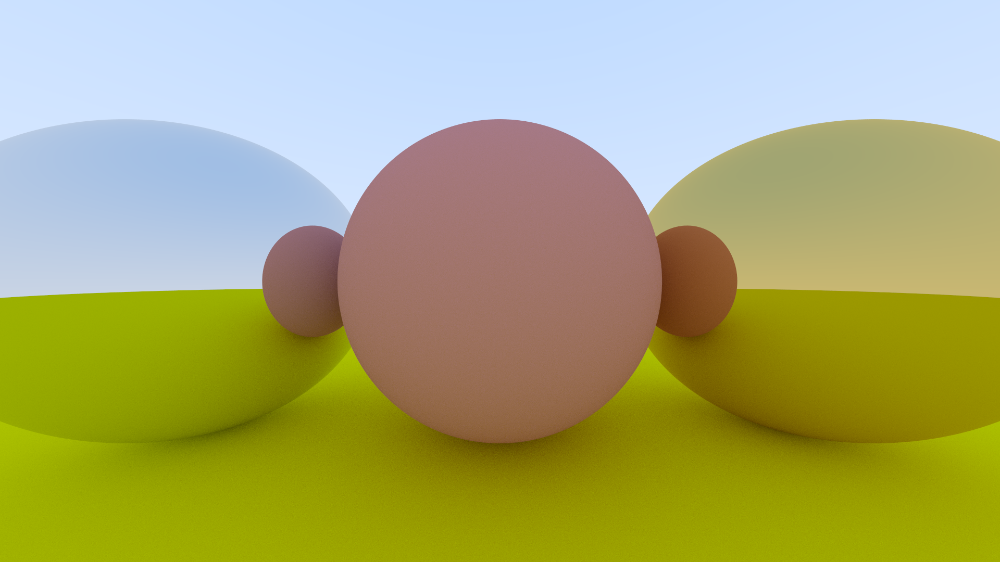
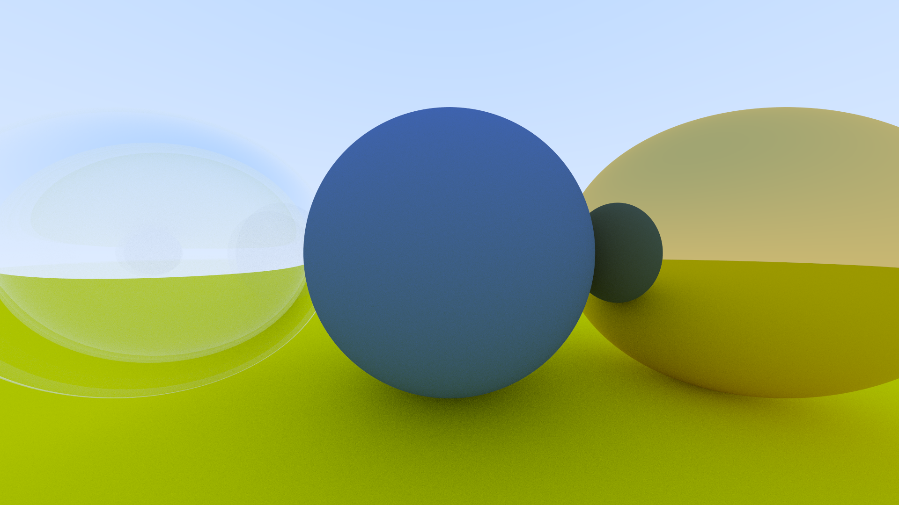
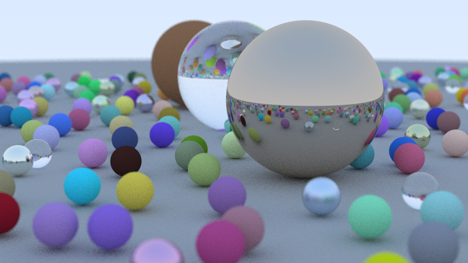
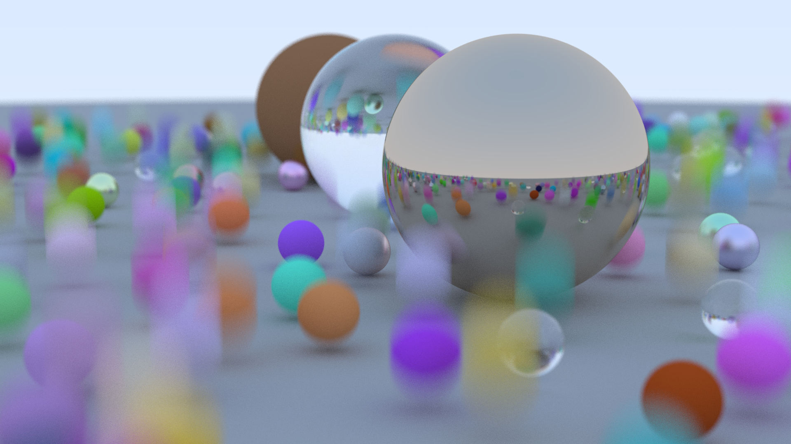
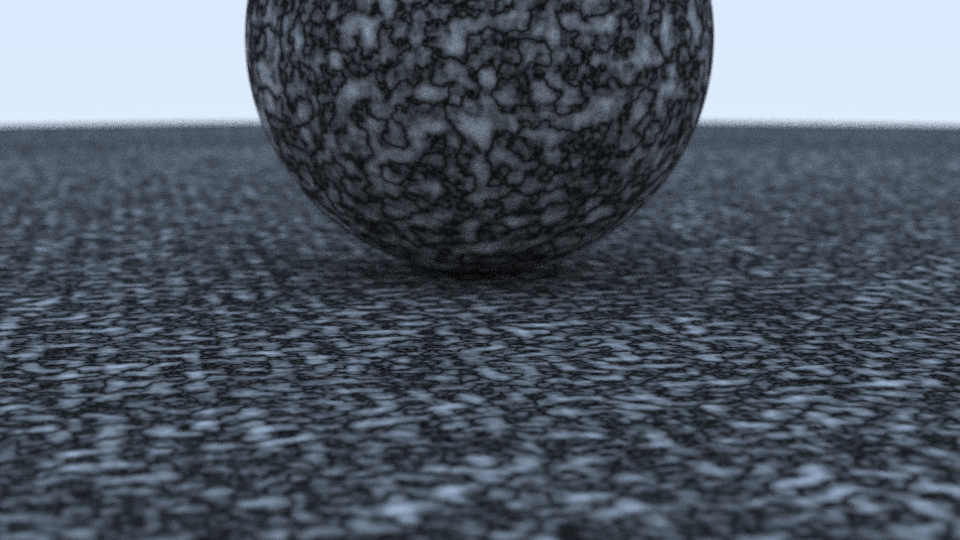
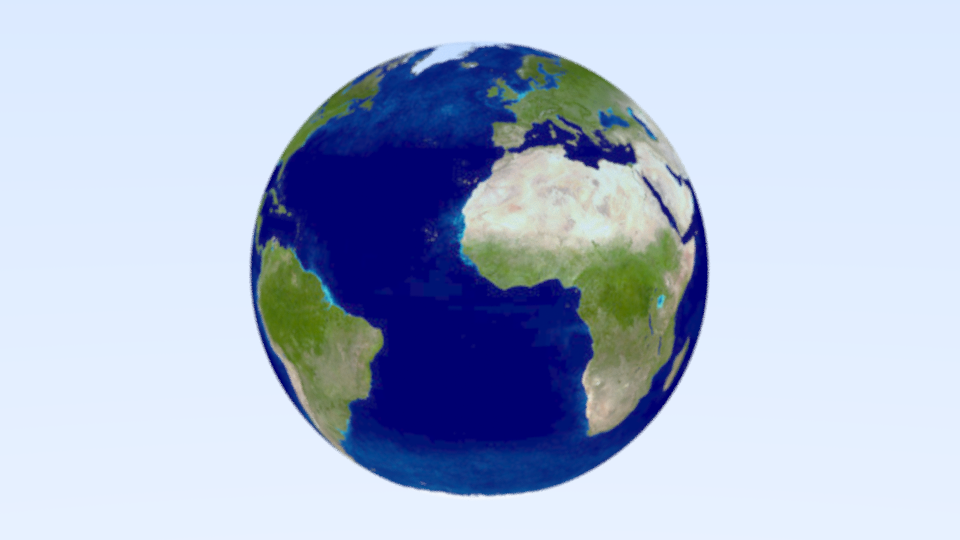
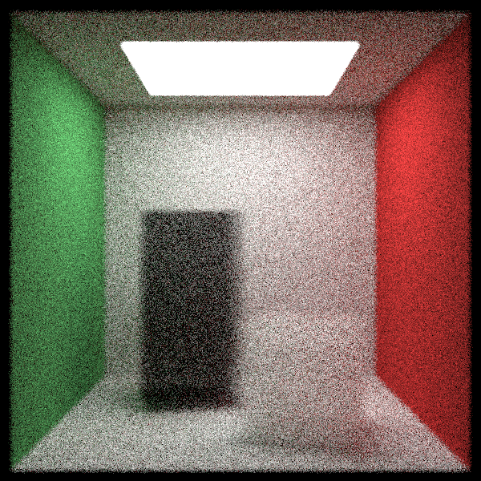

# Raytracer

A toy level raytracer written in C++, following [Ray tracing in one weekend](https://raytracing.github.io/).

## demo









## build

Require <code>cmake</code>, <code>OpenMP</code> (Windows).

Dependencies are already included in the <code>dependencies</code> directory.

```
git clone --recurse-submodules https://github.com/wivl/raytracer.git
cd raytracer
mkdir build && cd build
cmake ..
make
```
